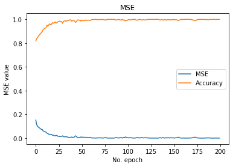

## 1. Import and process data
    
    - In this section, I import the data from files and normalize it, then I split the data to training and test sets
    
### 1.1. Import necessary packages


```python
import numpy as np
import pandas as pd
import matplotlib.pyplot as plt

from sklearn.preprocessing import StandardScaler
from sklearn.model_selection import train_test_split
from sklearn.metrics import mean_squared_error
from sklearn.metrics import confusion_matrix

from keras import Sequential
from keras.layers import Dense
from keras.layers.normalization import BatchNormalization
```

### 1.2. Import data
    - Import data from excel files using pandas, change nan values with 0 and convert it to numpy array


```python
X = pd.read_excel(r'Elearning-Data-cut.xls', sheet_name=0).fillna(0).to_numpy()
y1 = pd.read_excel(r'Elearning-Data-cut.xls', sheet_name=1).fillna(0).to_numpy()
y2 = pd.read_excel(r'Elearning-Data-cut.xls', sheet_name=2, usecols=[0]).fillna(0).to_numpy()
```

### 1.3. Normalize data
    - Normalizing features using Standard Scalar from sklearn


```python
sc = StandardScaler()
X = sc.fit_transform(X)
```

### 1.4. Split data
    - Splitting data in train and test sets using train_test_split method from sklearn


```python
X_train, X_test, y1_train, y1_test, y2_train, y2_test = train_test_split(X, y1, y2, test_size=0.1)


print(X_train.shape)
print(X_test.shape)

print(y1_train.shape)
print(y1_test.shape)

print(y2_train.shape)
print(y2_test.shape)
```

    (666, 28)
    (74, 28)
    (666, 1)
    (74, 1)
    (666, 1)
    (74, 1)


## 2. Building the binary classifier model and regression model
    
    - In this section, I build 2 training models using Keras
    
    - For binary classification I use a 3 layer neural network (2 hidden and 1 output), each containing 200, 100 and 1 neuron respectively.
    
    - For regression I use a 3 layer neural network (2 hidden and 1 output), each containing 200, 100 and 1 neuron respectively. After each layer's activation, I use a BatchNormalization layer for normalizing outputs.
    
### 2.1. Building binary classifier model


```python
classifier = Sequential()

# Batch Normalization Layer
classifier.add(BatchNormalization())

# First Hidden Layer
classifier.add(Dense(300, activation='relu', kernel_initializer='random_normal'))

# Second  Hidden Layer
classifier.add(Dense(200, activation='relu', kernel_initializer='random_normal'))

# Output Layer
classifier.add(Dense(1, activation='sigmoid', kernel_initializer='random_normal'))

# using adam optimizer alongside with binary cross entropy loss function
classifier.compile(optimizer ='adam', loss='binary_crossentropy', metrics =['mean_squared_error','accuracy'])
```

### 2.2. Building regression model


```python
model = Sequential()

# Batch Normalization Layer
model.add(BatchNormalization())

# First Hidden Layer
model.add(Dense(200, activation='relu', kernel_initializer='random_normal'))

# Batch Normalization Layer
model.add(BatchNormalization())

# Second  Hidden Layer
model.add(Dense(100, activation='relu', kernel_initializer='random_normal'))

# Batch Normalization Layer
model.add(BatchNormalization())

# Output Layer
model.add(Dense(1, kernel_initializer='normal'))

# using adam optimizer alongside with mean suared loss function
model.compile(optimizer ='adam',loss='mse', metrics =['mean_squared_error'])
```

## 3. Training and evaluation

### 3.1. Binary Classification


```python
progress = classifier.fit(X_train,y2_train, batch_size=32, epochs=200)
```

    Epoch 1/200
    21/21 [==============================] - 0s 2ms/step - loss: 0.4713 - mean_squared_error: 0.1525 - accuracy: 0.8183
    Epoch 2/200
    21/21 [==============================] - 0s 1ms/step - loss: 0.3499 - mean_squared_error: 0.1123 - accuracy: 0.8378
    Epoch 3/200
    21/21 [==============================] - 0s 1ms/step - loss: 0.3087 - mean_squared_error: 0.0997 - accuracy: 0.8468
    Epoch 4/200
    21/21 [==============================] - 0s 1ms/step - loss: 0.2824 - mean_squared_error: 0.0912 - accuracy: 0.8619
    Epoch 5/200
    21/21 [==============================] - 0s 1ms/step - loss: 0.2623 - mean_squared_error: 0.0859 - accuracy: 0.8694
    Epoch 6/200
    21/21 [==============================] - 0s 2ms/step - loss: 0.2473 - mean_squared_error: 0.0794 - accuracy: 0.8799
    Epoch 7/200
    21/21 [==============================] - 0s 1ms/step - loss: 0.2308 - mean_squared_error: 0.0735 - accuracy: 0.8874
    Epoch 8/200
    21/21 [==============================] - 0s 1ms/step - loss: 0.2316 - mean_squared_error: 0.0725 - accuracy: 0.8979
    Epoch 9/200
    21/21 [==============================] - 0s 1ms/step - loss: 0.1918 - mean_squared_error: 0.0598 - accuracy: 0.9144
    Epoch 10/200
    21/21 [==============================] - 0s 2ms/step - loss: 0.1869 - mean_squared_error: 0.0573 - accuracy: 0.9204
    Epoch 11/200
    21/21 [==============================] - 0s 1ms/step - loss: 0.1761 - mean_squared_error: 0.0535 - accuracy: 0.9249
    Epoch 12/200
    21/21 [==============================] - 0s 1ms/step - loss: 0.1624 - mean_squared_error: 0.0498 - accuracy: 0.9294
    Epoch 13/200
    21/21 [==============================] - 0s 1ms/step - loss: 0.1437 - mean_squared_error: 0.0421 - accuracy: 0.9505
    Epoch 14/200
    21/21 [==============================] - 0s 1ms/step - loss: 0.1271 - mean_squared_error: 0.0383 - accuracy: 0.9399
    Epoch 15/200
    21/21 [==============================] - 0s 1ms/step - loss: 0.1166 - mean_squared_error: 0.0336 - accuracy: 0.9535
    Epoch 16/200
    21/21 [==============================] - 0s 1ms/step - loss: 0.1062 - mean_squared_error: 0.0309 - accuracy: 0.9625
    Epoch 17/200
    21/21 [==============================] - 0s 1ms/step - loss: 0.1047 - mean_squared_error: 0.0318 - accuracy: 0.9550
    Epoch 18/200
    21/21 [==============================] - 0s 1ms/step - loss: 0.1069 - mean_squared_error: 0.0307 - accuracy: 0.9580
    Epoch 19/200
    21/21 [==============================] - 0s 1ms/step - loss: 0.0848 - mean_squared_error: 0.0243 - accuracy: 0.9715
    Epoch 20/200
    21/21 [==============================] - 0s 1ms/step - loss: 0.0869 - mean_squared_error: 0.0251 - accuracy: 0.9670
    Epoch 21/200
    21/21 [==============================] - 0s 1ms/step - loss: 0.0729 - mean_squared_error: 0.0198 - accuracy: 0.9730
    Epoch 22/200
    21/21 [==============================] - 0s 1ms/step - loss: 0.0688 - mean_squared_error: 0.0192 - accuracy: 0.9790
    Epoch 23/200
    21/21 [==============================] - 0s 1ms/step - loss: 0.0778 - mean_squared_error: 0.0231 - accuracy: 0.9685
    Epoch 24/200
    21/21 [==============================] - 0s 1ms/step - loss: 0.0768 - mean_squared_error: 0.0218 - accuracy: 0.9730
    Epoch 25/200
    21/21 [==============================] - 0s 1ms/step - loss: 0.0572 - mean_squared_error: 0.0151 - accuracy: 0.9805
    Epoch 26/200
    21/21 [==============================] - 0s 1ms/step - loss: 0.0613 - mean_squared_error: 0.0166 - accuracy: 0.9805
    Epoch 27/200
    21/21 [==============================] - 0s 1ms/step - loss: 0.0470 - mean_squared_error: 0.0124 - accuracy: 0.9850
    Epoch 28/200
    21/21 [==============================] - 0s 1ms/step - loss: 0.0524 - mean_squared_error: 0.0145 - accuracy: 0.9805
    Epoch 29/200
    21/21 [==============================] - 0s 1ms/step - loss: 0.0501 - mean_squared_error: 0.0138 - accuracy: 0.9820
    Epoch 30/200
    21/21 [==============================] - 0s 1ms/step - loss: 0.0635 - mean_squared_error: 0.0195 - accuracy: 0.9670
    Epoch 31/200
    21/21 [==============================] - 0s 1ms/step - loss: 0.0419 - mean_squared_error: 0.0113 - accuracy: 0.9835
    Epoch 32/200
    21/21 [==============================] - 0s 1ms/step - loss: 0.0432 - mean_squared_error: 0.0116 - accuracy: 0.9865
    Epoch 33/200
    21/21 [==============================] - 0s 1ms/step - loss: 0.0467 - mean_squared_error: 0.0109 - accuracy: 0.9880
    Epoch 34/200
    21/21 [==============================] - 0s 1ms/step - loss: 0.0447 - mean_squared_error: 0.0127 - accuracy: 0.9835
    Epoch 35/200
    21/21 [==============================] - 0s 1ms/step - loss: 0.0354 - mean_squared_error: 0.0096 - accuracy: 0.9895
    Epoch 36/200
    21/21 [==============================] - 0s 1ms/step - loss: 0.0301 - mean_squared_error: 0.0079 - accuracy: 0.9895
    Epoch 37/200
    21/21 [==============================] - 0s 1ms/step - loss: 0.0214 - mean_squared_error: 0.0051 - accuracy: 0.9940
    Epoch 38/200
    21/21 [==============================] - 0s 1ms/step - loss: 0.0208 - mean_squared_error: 0.0046 - accuracy: 0.9955
    Epoch 39/200
    21/21 [==============================] - 0s 1ms/step - loss: 0.0287 - mean_squared_error: 0.0072 - accuracy: 0.9955
    Epoch 40/200
    21/21 [==============================] - 0s 1ms/step - loss: 0.0328 - mean_squared_error: 0.0095 - accuracy: 0.9850
    Epoch 41/200
    21/21 [==============================] - 0s 1ms/step - loss: 0.0206 - mean_squared_error: 0.0053 - accuracy: 0.9925
    Epoch 42/200
    21/21 [==============================] - 0s 1ms/step - loss: 0.0249 - mean_squared_error: 0.0060 - accuracy: 0.9925
    Epoch 43/200
    21/21 [==============================] - 0s 1ms/step - loss: 0.0381 - mean_squared_error: 0.0112 - accuracy: 0.9850
    Epoch 44/200
    21/21 [==============================] - 0s 1ms/step - loss: 0.0663 - mean_squared_error: 0.0197 - accuracy: 0.9745
    Epoch 45/200
    21/21 [==============================] - 0s 1ms/step - loss: 0.0475 - mean_squared_error: 0.0138 - accuracy: 0.9805
    Epoch 46/200
    21/21 [==============================] - 0s 1ms/step - loss: 0.0177 - mean_squared_error: 0.0039 - accuracy: 0.9940
    Epoch 47/200
    21/21 [==============================] - 0s 1ms/step - loss: 0.0122 - mean_squared_error: 0.0023 - accuracy: 0.9955
    Epoch 48/200
    21/21 [==============================] - 0s 1ms/step - loss: 0.0251 - mean_squared_error: 0.0061 - accuracy: 0.9925
    Epoch 49/200
    21/21 [==============================] - 0s 1ms/step - loss: 0.0207 - mean_squared_error: 0.0055 - accuracy: 0.9940
    Epoch 50/200
    21/21 [==============================] - 0s 1ms/step - loss: 0.0346 - mean_squared_error: 0.0105 - accuracy: 0.9850
    Epoch 51/200
    21/21 [==============================] - 0s 1ms/step - loss: 0.0230 - mean_squared_error: 0.0059 - accuracy: 0.9940
    Epoch 52/200
    21/21 [==============================] - 0s 1ms/step - loss: 0.0280 - mean_squared_error: 0.0080 - accuracy: 0.9895
    Epoch 53/200
    21/21 [==============================] - 0s 1ms/step - loss: 0.0323 - mean_squared_error: 0.0078 - accuracy: 0.9895
    Epoch 54/200
    21/21 [==============================] - 0s 1ms/step - loss: 0.0243 - mean_squared_error: 0.0068 - accuracy: 0.9895
    Epoch 55/200
    21/21 [==============================] - 0s 1ms/step - loss: 0.0241 - mean_squared_error: 0.0050 - accuracy: 0.9955
    Epoch 56/200
    21/21 [==============================] - 0s 1ms/step - loss: 0.0310 - mean_squared_error: 0.0073 - accuracy: 0.9910
    Epoch 57/200
    21/21 [==============================] - 0s 1ms/step - loss: 0.0203 - mean_squared_error: 0.0053 - accuracy: 0.9925
    Epoch 58/200
    21/21 [==============================] - 0s 1ms/step - loss: 0.0187 - mean_squared_error: 0.0046 - accuracy: 0.9940
    Epoch 59/200
    21/21 [==============================] - 0s 1ms/step - loss: 0.0224 - mean_squared_error: 0.0064 - accuracy: 0.9910
    Epoch 60/200
    21/21 [==============================] - 0s 1ms/step - loss: 0.0300 - mean_squared_error: 0.0061 - accuracy: 0.9910
    Epoch 61/200
    21/21 [==============================] - 0s 1ms/step - loss: 0.0131 - mean_squared_error: 0.0033 - accuracy: 0.9955
    Epoch 62/200
    21/21 [==============================] - 0s 1ms/step - loss: 0.0048 - mean_squared_error: 4.3758e-04 - accuracy: 1.0000
    Epoch 63/200
    21/21 [==============================] - 0s 1ms/step - loss: 0.0067 - mean_squared_error: 0.0013 - accuracy: 0.9985
    Epoch 64/200
    21/21 [==============================] - 0s 1ms/step - loss: 0.0083 - mean_squared_error: 0.0017 - accuracy: 0.9985
    Epoch 65/200
    21/21 [==============================] - 0s 1ms/step - loss: 0.0044 - mean_squared_error: 4.5522e-04 - accuracy: 1.0000
    Epoch 66/200
    21/21 [==============================] - 0s 1ms/step - loss: 0.0044 - mean_squared_error: 4.1477e-04 - accuracy: 1.0000
    Epoch 67/200
    21/21 [==============================] - 0s 1ms/step - loss: 0.0048 - mean_squared_error: 6.5787e-04 - accuracy: 1.0000
    Epoch 68/200
    21/21 [==============================] - 0s 1ms/step - loss: 0.0114 - mean_squared_error: 0.0027 - accuracy: 0.9955
    Epoch 69/200
    21/21 [==============================] - 0s 1ms/step - loss: 0.0101 - mean_squared_error: 0.0021 - accuracy: 0.9985
    Epoch 70/200
    21/21 [==============================] - 0s 999us/step - loss: 0.0078 - mean_squared_error: 0.0017 - accuracy: 0.9985
    Epoch 71/200
    21/21 [==============================] - 0s 1ms/step - loss: 0.0146 - mean_squared_error: 0.0026 - accuracy: 0.9985
    Epoch 72/200
    21/21 [==============================] - 0s 1ms/step - loss: 0.0060 - mean_squared_error: 0.0012 - accuracy: 0.9985
    Epoch 73/200
    21/21 [==============================] - 0s 1ms/step - loss: 0.0063 - mean_squared_error: 0.0014 - accuracy: 0.9985
    Epoch 74/200
    21/21 [==============================] - 0s 1ms/step - loss: 0.0033 - mean_squared_error: 2.9700e-04 - accuracy: 1.0000
    Epoch 75/200
    21/21 [==============================] - 0s 1ms/step - loss: 0.0099 - mean_squared_error: 0.0028 - accuracy: 0.9955    
    Epoch 76/200
    21/21 [==============================] - 0s 1ms/step - loss: 0.0105 - mean_squared_error: 0.0025 - accuracy: 0.9970
    Epoch 77/200
    21/21 [==============================] - 0s 1ms/step - loss: 0.0180 - mean_squared_error: 0.0051 - accuracy: 0.9925
    Epoch 78/200
    21/21 [==============================] - 0s 1ms/step - loss: 0.0065 - mean_squared_error: 0.0011 - accuracy: 1.0000
    Epoch 79/200
    21/21 [==============================] - 0s 1ms/step - loss: 0.0035 - mean_squared_error: 4.7283e-04 - accuracy: 1.0000
    Epoch 80/200
    21/21 [==============================] - 0s 1ms/step - loss: 0.0041 - mean_squared_error: 6.6461e-04 - accuracy: 1.0000
    Epoch 81/200
    21/21 [==============================] - 0s 1ms/step - loss: 0.0023 - mean_squared_error: 1.5997e-04 - accuracy: 1.0000
    Epoch 82/200
    21/21 [==============================] - 0s 1ms/step - loss: 0.0033 - mean_squared_error: 3.9275e-04 - accuracy: 1.0000
    Epoch 83/200
    21/21 [==============================] - 0s 1ms/step - loss: 0.0032 - mean_squared_error: 3.5988e-04 - accuracy: 1.0000
    Epoch 84/200
    21/21 [==============================] - 0s 1ms/step - loss: 0.0025 - mean_squared_error: 2.6559e-04 - accuracy: 1.0000
    Epoch 85/200
    21/21 [==============================] - 0s 1ms/step - loss: 0.0015 - mean_squared_error: 7.4805e-05 - accuracy: 1.0000
    Epoch 86/200
    21/21 [==============================] - 0s 1ms/step - loss: 0.0051 - mean_squared_error: 0.0013 - accuracy: 0.9985    
    Epoch 87/200
    21/21 [==============================] - 0s 1ms/step - loss: 0.0102 - mean_squared_error: 0.0022 - accuracy: 0.9985
    Epoch 88/200
    21/21 [==============================] - 0s 1ms/step - loss: 0.0144 - mean_squared_error: 0.0045 - accuracy: 0.9940
    Epoch 89/200
    21/21 [==============================] - 0s 1ms/step - loss: 0.0211 - mean_squared_error: 0.0046 - accuracy: 0.9955
    Epoch 90/200
    21/21 [==============================] - 0s 1ms/step - loss: 0.0070 - mean_squared_error: 0.0015 - accuracy: 0.9985
    Epoch 91/200
    21/21 [==============================] - 0s 1ms/step - loss: 0.0034 - mean_squared_error: 4.0771e-04 - accuracy: 1.0000
    Epoch 92/200
    21/21 [==============================] - 0s 1ms/step - loss: 0.0102 - mean_squared_error: 0.0028 - accuracy: 0.9970
    Epoch 93/200
    21/21 [==============================] - 0s 1ms/step - loss: 0.0217 - mean_squared_error: 0.0056 - accuracy: 0.9940
    Epoch 94/200
    21/21 [==============================] - 0s 1ms/step - loss: 0.0099 - mean_squared_error: 0.0027 - accuracy: 0.9970
    Epoch 95/200
    21/21 [==============================] - 0s 1ms/step - loss: 0.0051 - mean_squared_error: 6.8659e-04 - accuracy: 1.0000
    Epoch 96/200
    21/21 [==============================] - 0s 1ms/step - loss: 0.0190 - mean_squared_error: 0.0057 - accuracy: 0.9925
    Epoch 97/200
    21/21 [==============================] - 0s 1ms/step - loss: 0.0142 - mean_squared_error: 0.0042 - accuracy: 0.9955
    Epoch 98/200
    21/21 [==============================] - 0s 1ms/step - loss: 0.0406 - mean_squared_error: 0.0101 - accuracy: 0.9865
    Epoch 99/200
    21/21 [==============================] - 0s 1ms/step - loss: 0.0197 - mean_squared_error: 0.0056 - accuracy: 0.9925
    Epoch 100/200
    21/21 [==============================] - 0s 1ms/step - loss: 0.0191 - mean_squared_error: 0.0055 - accuracy: 0.9910    
    Epoch 101/200
    21/21 [==============================] - 0s 1ms/step - loss: 0.0166 - mean_squared_error: 0.0042 - accuracy: 0.9970
    Epoch 102/200
    21/21 [==============================] - 0s 1ms/step - loss: 0.0078 - mean_squared_error: 0.0017 - accuracy: 0.9985
    Epoch 103/200
    21/21 [==============================] - 0s 1ms/step - loss: 0.0104 - mean_squared_error: 0.0030 - accuracy: 0.9970    
    Epoch 104/200
    21/21 [==============================] - 0s 1ms/step - loss: 0.0125 - mean_squared_error: 0.0038 - accuracy: 0.9940
    Epoch 105/200
    21/21 [==============================] - 0s 1ms/step - loss: 0.0075 - mean_squared_error: 0.0018 - accuracy: 0.9985    
    Epoch 106/200
    21/21 [==============================] - 0s 1ms/step - loss: 0.0036 - mean_squared_error: 4.0218e-04 - accuracy: 1.0000
    Epoch 107/200
    21/21 [==============================] - 0s 1ms/step - loss: 0.0041 - mean_squared_error: 6.9299e-04 - accuracy: 1.0000
    Epoch 108/200
    21/21 [==============================] - 0s 1ms/step - loss: 0.0036 - mean_squared_error: 4.5089e-04 - accuracy: 1.0000
    Epoch 109/200
    21/21 [==============================] - 0s 1ms/step - loss: 0.0033 - mean_squared_error: 9.0529e-04 - accuracy: 0.9985
    Epoch 110/200
    21/21 [==============================] - 0s 1ms/step - loss: 0.0132 - mean_squared_error: 0.0040 - accuracy: 0.9940    
    Epoch 111/200
    21/21 [==============================] - 0s 1ms/step - loss: 0.0208 - mean_squared_error: 0.0057 - accuracy: 0.9925
    Epoch 112/200
    21/21 [==============================] - 0s 1ms/step - loss: 0.0122 - mean_squared_error: 0.0033 - accuracy: 0.9970    
    Epoch 113/200
    21/21 [==============================] - 0s 1ms/step - loss: 0.0053 - mean_squared_error: 0.0010 - accuracy: 1.0000
    Epoch 114/200
    21/21 [==============================] - 0s 1ms/step - loss: 0.0124 - mean_squared_error: 0.0020 - accuracy: 0.9985    
    Epoch 115/200
    21/21 [==============================] - 0s 1ms/step - loss: 0.0234 - mean_squared_error: 0.0045 - accuracy: 0.9955
    Epoch 116/200
    21/21 [==============================] - 0s 1ms/step - loss: 0.0370 - mean_squared_error: 0.0046 - accuracy: 0.9955    
    Epoch 117/200
    21/21 [==============================] - 0s 1ms/step - loss: 0.0068 - mean_squared_error: 0.0017 - accuracy: 0.9970
    Epoch 118/200
    21/21 [==============================] - 0s 1ms/step - loss: 0.0087 - mean_squared_error: 0.0022 - accuracy: 0.9970
    Epoch 119/200
    21/21 [==============================] - 0s 1ms/step - loss: 0.0106 - mean_squared_error: 0.0032 - accuracy: 0.9955    
    Epoch 120/200
    21/21 [==============================] - 0s 1ms/step - loss: 0.0119 - mean_squared_error: 0.0037 - accuracy: 0.9955    
    Epoch 121/200
    21/21 [==============================] - 0s 1ms/step - loss: 0.0085 - mean_squared_error: 0.0025 - accuracy: 0.9970    
    Epoch 122/200
    21/21 [==============================] - 0s 1ms/step - loss: 0.0067 - mean_squared_error: 0.0018 - accuracy: 0.9985
    Epoch 123/200
    21/21 [==============================] - 0s 1ms/step - loss: 0.0032 - mean_squared_error: 6.3403e-04 - accuracy: 0.9985
    Epoch 124/200
    21/21 [==============================] - 0s 1ms/step - loss: 0.0026 - mean_squared_error: 4.0186e-04 - accuracy: 1.0000
    Epoch 125/200
    21/21 [==============================] - 0s 1ms/step - loss: 0.0022 - mean_squared_error: 2.4084e-04 - accuracy: 1.0000
    Epoch 126/200
    21/21 [==============================] - 0s 1ms/step - loss: 0.0012 - mean_squared_error: 7.1953e-05 - accuracy: 1.0000
    Epoch 127/200
    21/21 [==============================] - 0s 1ms/step - loss: 0.0017 - mean_squared_error: 2.5721e-04 - accuracy: 1.0000
    Epoch 128/200
    21/21 [==============================] - 0s 1ms/step - loss: 0.0025 - mean_squared_error: 2.5114e-04 - accuracy: 1.0000
    Epoch 129/200
    21/21 [==============================] - 0s 1ms/step - loss: 0.0025 - mean_squared_error: 7.1622e-04 - accuracy: 0.9985
    Epoch 130/200
    21/21 [==============================] - 0s 1ms/step - loss: 0.0029 - mean_squared_error: 4.8756e-04 - accuracy: 1.0000
    Epoch 131/200
    21/21 [==============================] - 0s 1ms/step - loss: 0.0027 - mean_squared_error: 4.5775e-04 - accuracy: 1.0000
    Epoch 132/200
    21/21 [==============================] - 0s 1ms/step - loss: 9.2373e-04 - mean_squared_error: 2.2747e-05 - accuracy: 1.0000
    Epoch 133/200
    21/21 [==============================] - 0s 1ms/step - loss: 0.0032 - mean_squared_error: 4.4831e-04 - accuracy: 1.0000
    Epoch 134/200
    21/21 [==============================] - 0s 1ms/step - loss: 0.0014 - mean_squared_error: 1.5527e-04 - accuracy: 1.0000
    Epoch 135/200
    21/21 [==============================] - 0s 1ms/step - loss: 0.0088 - mean_squared_error: 0.0030 - accuracy: 0.9955
    Epoch 136/200
    21/21 [==============================] - 0s 1ms/step - loss: 0.0102 - mean_squared_error: 0.0033 - accuracy: 0.9940
    Epoch 137/200
    21/21 [==============================] - 0s 1ms/step - loss: 0.0042 - mean_squared_error: 6.2215e-04 - accuracy: 1.0000
    Epoch 138/200
    21/21 [==============================] - 0s 1ms/step - loss: 0.0106 - mean_squared_error: 0.0026 - accuracy: 0.9970
    Epoch 139/200
    21/21 [==============================] - 0s 1ms/step - loss: 0.0158 - mean_squared_error: 0.0048 - accuracy: 0.9925    
    Epoch 140/200
    21/21 [==============================] - 0s 1ms/step - loss: 0.0029 - mean_squared_error: 3.5260e-04 - accuracy: 1.0000
    Epoch 141/200
    21/21 [==============================] - 0s 1ms/step - loss: 0.0046 - mean_squared_error: 0.0011 - accuracy: 0.9985
    Epoch 142/200
    21/21 [==============================] - 0s 1ms/step - loss: 0.0123 - mean_squared_error: 0.0040 - accuracy: 0.9925    
    Epoch 143/200
    21/21 [==============================] - 0s 1ms/step - loss: 0.0039 - mean_squared_error: 0.0010 - accuracy: 0.9985    
    Epoch 144/200
    21/21 [==============================] - 0s 999us/step - loss: 0.0135 - mean_squared_error: 0.0032 - accuracy: 0.9970  
    Epoch 145/200
    21/21 [==============================] - 0s 1ms/step - loss: 0.0137 - mean_squared_error: 0.0030 - accuracy: 0.9970
    Epoch 146/200
    21/21 [==============================] - 0s 1ms/step - loss: 0.0026 - mean_squared_error: 3.9200e-04 - accuracy: 1.0000
    Epoch 147/200
    21/21 [==============================] - 0s 1ms/step - loss: 0.0115 - mean_squared_error: 0.0036 - accuracy: 0.9940
    Epoch 148/200
    21/21 [==============================] - 0s 1ms/step - loss: 0.0142 - mean_squared_error: 0.0027 - accuracy: 0.9985
    Epoch 149/200
    21/21 [==============================] - 0s 1ms/step - loss: 0.0080 - mean_squared_error: 0.0020 - accuracy: 0.9970    
    Epoch 150/200
    21/21 [==============================] - 0s 1ms/step - loss: 0.0087 - mean_squared_error: 0.0019 - accuracy: 0.9985
    Epoch 151/200
    21/21 [==============================] - 0s 1ms/step - loss: 0.0045 - mean_squared_error: 8.4676e-04 - accuracy: 0.9985
    Epoch 152/200
    21/21 [==============================] - 0s 1ms/step - loss: 0.0063 - mean_squared_error: 0.0018 - accuracy: 0.9970    
    Epoch 153/200
    21/21 [==============================] - 0s 1ms/step - loss: 0.0096 - mean_squared_error: 0.0028 - accuracy: 0.9970
    Epoch 154/200
    21/21 [==============================] - 0s 1ms/step - loss: 0.0251 - mean_squared_error: 0.0029 - accuracy: 0.9970    
    Epoch 155/200
    21/21 [==============================] - 0s 1ms/step - loss: 0.0306 - mean_squared_error: 0.0074 - accuracy: 0.9895    
    Epoch 156/200
    21/21 [==============================] - 0s 1ms/step - loss: 0.0260 - mean_squared_error: 0.0069 - accuracy: 0.9925
    Epoch 157/200
    21/21 [==============================] - 0s 1ms/step - loss: 0.0093 - mean_squared_error: 0.0027 - accuracy: 0.9955    
    Epoch 158/200
    21/21 [==============================] - 0s 1ms/step - loss: 0.0026 - mean_squared_error: 3.5550e-04 - accuracy: 1.0000
    Epoch 159/200
    21/21 [==============================] - 0s 1ms/step - loss: 0.0031 - mean_squared_error: 4.5160e-04 - accuracy: 1.0000
    Epoch 160/200
    21/21 [==============================] - 0s 1ms/step - loss: 0.0020 - mean_squared_error: 2.0337e-04 - accuracy: 1.0000
    Epoch 161/200
    21/21 [==============================] - 0s 1ms/step - loss: 0.0031 - mean_squared_error: 7.2116e-04 - accuracy: 0.9985
    Epoch 162/200
    21/21 [==============================] - 0s 1ms/step - loss: 0.0014 - mean_squared_error: 6.0173e-05 - accuracy: 1.0000
    Epoch 163/200
    21/21 [==============================] - 0s 1ms/step - loss: 0.0012 - mean_squared_error: 5.7574e-05 - accuracy: 1.0000
    Epoch 164/200
    21/21 [==============================] - 0s 1ms/step - loss: 0.0019 - mean_squared_error: 1.7655e-04 - accuracy: 1.0000
    Epoch 165/200
    21/21 [==============================] - 0s 1ms/step - loss: 5.9671e-04 - mean_squared_error: 2.5063e-05 - accuracy: 1.0000
    Epoch 166/200
    21/21 [==============================] - 0s 1ms/step - loss: 0.0011 - mean_squared_error: 5.8668e-05 - accuracy: 1.0000
    Epoch 167/200
    21/21 [==============================] - 0s 1ms/step - loss: 9.8493e-04 - mean_squared_error: 5.1807e-05 - accuracy: 1.0000
    Epoch 168/200
    21/21 [==============================] - 0s 1ms/step - loss: 0.0024 - mean_squared_error: 5.1824e-04 - accuracy: 1.0000
    Epoch 169/200
    21/21 [==============================] - 0s 1ms/step - loss: 0.0067 - mean_squared_error: 0.0020 - accuracy: 0.9970    
    Epoch 170/200
    21/21 [==============================] - 0s 1ms/step - loss: 0.0107 - mean_squared_error: 0.0016 - accuracy: 0.9985    
    Epoch 171/200
    21/21 [==============================] - 0s 1ms/step - loss: 0.0154 - mean_squared_error: 0.0039 - accuracy: 0.9955
    Epoch 172/200
    21/21 [==============================] - 0s 1ms/step - loss: 0.0186 - mean_squared_error: 0.0059 - accuracy: 0.9910    
    Epoch 173/200
    21/21 [==============================] - 0s 1ms/step - loss: 0.0392 - mean_squared_error: 0.0073 - accuracy: 0.9925
    Epoch 174/200
    21/21 [==============================] - 0s 1ms/step - loss: 0.0393 - mean_squared_error: 0.0078 - accuracy: 0.9880    
    Epoch 175/200
    21/21 [==============================] - 0s 1ms/step - loss: 0.0124 - mean_squared_error: 0.0032 - accuracy: 0.9940
    Epoch 176/200
    21/21 [==============================] - 0s 1ms/step - loss: 0.0053 - mean_squared_error: 0.0014 - accuracy: 0.9985
    Epoch 177/200
    21/21 [==============================] - 0s 1ms/step - loss: 0.0069 - mean_squared_error: 0.0016 - accuracy: 0.9985
    Epoch 178/200
    21/21 [==============================] - 0s 1ms/step - loss: 0.0029 - mean_squared_error: 5.2987e-04 - accuracy: 1.0000
    Epoch 179/200
    21/21 [==============================] - 0s 1ms/step - loss: 0.0011 - mean_squared_error: 4.4633e-05 - accuracy: 1.0000
    Epoch 180/200
    21/21 [==============================] - 0s 1ms/step - loss: 0.0019 - mean_squared_error: 1.7053e-04 - accuracy: 1.0000
    Epoch 181/200
    21/21 [==============================] - 0s 1ms/step - loss: 8.9733e-04 - mean_squared_error: 2.8113e-05 - accuracy: 1.0000
    Epoch 182/200
    21/21 [==============================] - 0s 1ms/step - loss: 6.8495e-04 - mean_squared_error: 1.4754e-05 - accuracy: 1.0000
    Epoch 183/200
    21/21 [==============================] - 0s 1ms/step - loss: 0.0034 - mean_squared_error: 9.1223e-04 - accuracy: 0.9985
    Epoch 184/200
    21/21 [==============================] - 0s 1ms/step - loss: 0.0020 - mean_squared_error: 1.6441e-04 - accuracy: 1.0000
    Epoch 185/200
    21/21 [==============================] - 0s 1ms/step - loss: 0.0071 - mean_squared_error: 0.0021 - accuracy: 0.9970    
    Epoch 186/200
    21/21 [==============================] - 0s 2ms/step - loss: 0.0012 - mean_squared_error: 5.0077e-05 - accuracy: 1.0000
    Epoch 187/200
    21/21 [==============================] - 0s 2ms/step - loss: 0.0083 - mean_squared_error: 0.0024 - accuracy: 0.9970
    Epoch 188/200
    21/21 [==============================] - 0s 2ms/step - loss: 0.0071 - mean_squared_error: 0.0023 - accuracy: 0.9955
    Epoch 189/200
    21/21 [==============================] - 0s 2ms/step - loss: 0.0049 - mean_squared_error: 7.7882e-04 - accuracy: 1.0000
    Epoch 190/200
    21/21 [==============================] - 0s 2ms/step - loss: 0.0026 - mean_squared_error: 4.2664e-04 - accuracy: 1.0000
    Epoch 191/200
    21/21 [==============================] - 0s 1ms/step - loss: 0.0021 - mean_squared_error: 4.5823e-04 - accuracy: 0.9985
    Epoch 192/200
    21/21 [==============================] - 0s 1ms/step - loss: 8.1113e-04 - mean_squared_error: 4.8833e-05 - accuracy: 1.0000
    Epoch 193/200
    21/21 [==============================] - 0s 1ms/step - loss: 8.1925e-04 - mean_squared_error: 3.1420e-05 - accuracy: 1.0000
    Epoch 194/200
    21/21 [==============================] - 0s 1ms/step - loss: 9.3823e-04 - mean_squared_error: 1.2529e-04 - accuracy: 1.0000
    Epoch 195/200
    21/21 [==============================] - 0s 1ms/step - loss: 8.4235e-04 - mean_squared_error: 4.3692e-05 - accuracy: 1.0000
    Epoch 196/200
    21/21 [==============================] - 0s 1ms/step - loss: 0.0026 - mean_squared_error: 7.2649e-04 - accuracy: 0.9985
    Epoch 197/200
    21/21 [==============================] - 0s 1ms/step - loss: 0.0021 - mean_squared_error: 3.0161e-04 - accuracy: 1.0000
    Epoch 198/200
    21/21 [==============================] - 0s 1ms/step - loss: 0.0016 - mean_squared_error: 1.5377e-04 - accuracy: 1.0000
    Epoch 199/200
    21/21 [==============================] - 0s 1ms/step - loss: 0.0016 - mean_squared_error: 3.3919e-04 - accuracy: 1.0000
    Epoch 200/200
    21/21 [==============================] - 0s 1ms/step - loss: 6.9778e-04 - mean_squared_error: 5.3311e-05 - accuracy: 1.0000


```python
print('\nEvaluation result:')
eval_model=classifier.evaluate(X_test, y2_test)
```

    
    Evaluation result:
    3/3 [==============================] - 0s 1ms/step - loss: 1.2989 - mean_squared_error: 0.1215 - accuracy: 0.8649


```python
# Calculating the Confusion Matrix

y_pred=classifier.predict(X_test)
y_pred =(y_pred > 0.5)

cm = confusion_matrix(y2_test, y_pred)
print(cm)
```

    [[ 5  9]
     [ 1 59]]


```python
# Plotting error and accuracy in training

plt.plot(progress.history['mean_squared_error'], label='MSE')
plt.plot(progress.history['accuracy'], label='Accuracy')
plt.title('MSE')
plt.ylabel('MSE value')
plt.xlabel('No. epoch')
plt.legend(loc="center right")
plt.show()
```





### 3.2. Regression


```python
progress = model.fit(X_train,y1_train, batch_size=32, epochs=1000)
```

    Epoch 1/1000
    21/21 [==============================] - 0s 1ms/step - loss: 200.3454 - mean_squared_error: 200.3454
    Epoch 2/1000
    21/21 [==============================] - 0s 1ms/step - loss: 194.7979 - mean_squared_error: 194.7979
    Epoch 3/1000
    21/21 [==============================] - 0s 1ms/step - loss: 187.6591 - mean_squared_error: 187.6591
    Epoch 4/1000
    21/21 [==============================] - 0s 1ms/step - loss: 175.9115 - mean_squared_error: 175.9115
    Epoch 5/1000
    21/21 [==============================] - 0s 1ms/step - loss: 159.3386 - mean_squared_error: 159.3386
    Epoch 6/1000
    21/21 [==============================] - 0s 1ms/step - loss: 138.4619 - mean_squared_error: 138.4619
    Epoch 7/1000
    21/21 [==============================] - 0s 1ms/step - loss: 115.0455 - mean_squared_error: 115.0455
    Epoch 8/1000
    21/21 [==============================] - 0s 1ms/step - loss: 90.6294 - mean_squared_error: 90.6294
    Epoch 9/1000
    21/21 [==============================] - 0s 1ms/step - loss: 67.3699 - mean_squared_error: 67.3699
    Epoch 10/1000
    21/21 [==============================] - 0s 1ms/step - loss: 46.8825 - mean_squared_error: 46.8825
    Epoch 11/1000
    21/21 [==============================] - 0s 1ms/step - loss: 30.3208 - mean_squared_error: 30.3208
    Epoch 12/1000
    21/21 [==============================] - 0s 1ms/step - loss: 18.3162 - mean_squared_error: 18.3162
    Epoch 13/1000
    21/21 [==============================] - 0s 1ms/step - loss: 10.1073 - mean_squared_error: 10.1073
    Epoch 14/1000
    21/21 [==============================] - 0s 1ms/step - loss: 5.5234 - mean_squared_error: 5.5234
    Epoch 15/1000
    21/21 [==============================] - 0s 1ms/step - loss: 3.1107 - mean_squared_error: 3.1107
    Epoch 16/1000
    21/21 [==============================] - 0s 1ms/step - loss: 1.9683 - mean_squared_error: 1.9683
    Epoch 17/1000
    21/21 [==============================] - 0s 1ms/step - loss: 1.5435 - mean_squared_error: 1.5435
    Epoch 18/1000
    21/21 [==============================] - 0s 1ms/step - loss: 1.2781 - mean_squared_error: 1.2781
    Epoch 19/1000
    21/21 [==============================] - 0s 1ms/step - loss: 1.1827 - mean_squared_error: 1.1827
    Epoch 20/1000
    21/21 [==============================] - 0s 1ms/step - loss: 1.2365 - mean_squared_error: 1.2365
    Epoch 21/1000
    21/21 [==============================] - 0s 1ms/step - loss: 0.8287 - mean_squared_error: 0.8287
    Epoch 22/1000
    21/21 [==============================] - 0s 1ms/step - loss: 1.0931 - mean_squared_error: 1.0931
    Epoch 23/1000
    21/21 [==============================] - 0s 1ms/step - loss: 0.8339 - mean_squared_error: 0.8339
    Epoch 24/1000
    21/21 [==============================] - 0s 1ms/step - loss: 0.9278 - mean_squared_error: 0.9278
    Epoch 25/1000
    21/21 [==============================] - 0s 1ms/step - loss: 1.0836 - mean_squared_error: 1.0836
    Epoch 26/1000
    21/21 [==============================] - 0s 1ms/step - loss: 0.7456 - mean_squared_error: 0.7456
    Epoch 27/1000
    21/21 [==============================] - 0s 1ms/step - loss: 0.7636 - mean_squared_error: 0.7636
    Epoch 28/1000
    21/21 [==============================] - 0s 1ms/step - loss: 0.8202 - mean_squared_error: 0.8202
    Epoch 29/1000
    21/21 [==============================] - 0s 1ms/step - loss: 0.7792 - mean_squared_error: 0.7792
    Epoch 30/1000
    21/21 [==============================] - 0s 1ms/step - loss: 0.7766 - mean_squared_error: 0.7766
    Epoch 31/1000
    21/21 [==============================] - 0s 1ms/step - loss: 0.8235 - mean_squared_error: 0.8235
    Epoch 32/1000
    21/21 [==============================] - 0s 1ms/step - loss: 0.9086 - mean_squared_error: 0.9086
    Epoch 33/1000
    21/21 [==============================] - 0s 1ms/step - loss: 0.8579 - mean_squared_error: 0.8579
    Epoch 34/1000
    21/21 [==============================] - 0s 1ms/step - loss: 0.9845 - mean_squared_error: 0.9845
    Epoch 35/1000
    21/21 [==============================] - 0s 1ms/step - loss: 0.7412 - mean_squared_error: 0.7412
    Epoch 36/1000
    21/21 [==============================] - 0s 1ms/step - loss: 0.7715 - mean_squared_error: 0.7715
    Epoch 37/1000
    21/21 [==============================] - 0s 1ms/step - loss: 1.0314 - mean_squared_error: 1.0314
    Epoch 38/1000
    21/21 [==============================] - 0s 1ms/step - loss: 0.6540 - mean_squared_error: 0.6540
    Epoch 39/1000
    21/21 [==============================] - 0s 1ms/step - loss: 0.5415 - mean_squared_error: 0.5415
    Epoch 40/1000
    21/21 [==============================] - 0s 1ms/step - loss: 0.7973 - mean_squared_error: 0.7973
    Epoch 41/1000
    21/21 [==============================] - 0s 2ms/step - loss: 0.7276 - mean_squared_error: 0.7276
    Epoch 42/1000
    21/21 [==============================] - 0s 2ms/step - loss: 0.7476 - mean_squared_error: 0.7476
    Epoch 43/1000
    21/21 [==============================] - 0s 2ms/step - loss: 0.7725 - mean_squared_error: 0.7725
    Epoch 44/1000
    21/21 [==============================] - 0s 2ms/step - loss: 0.7091 - mean_squared_error: 0.7091
    Epoch 45/1000
    21/21 [==============================] - 0s 2ms/step - loss: 0.5028 - mean_squared_error: 0.5028
    Epoch 46/1000
    21/21 [==============================] - 0s 2ms/step - loss: 0.5609 - mean_squared_error: 0.5609
    Epoch 47/1000
    21/21 [==============================] - 0s 2ms/step - loss: 0.6597 - mean_squared_error: 0.6597
    Epoch 48/1000
    21/21 [==============================] - 0s 1ms/step - loss: 0.5898 - mean_squared_error: 0.5898
    Epoch 49/1000
    21/21 [==============================] - 0s 1ms/step - loss: 0.5583 - mean_squared_error: 0.5583
    Epoch 50/1000
    21/21 [==============================] - 0s 1ms/step - loss: 0.6457 - mean_squared_error: 0.6457
    Epoch 51/1000
    21/21 [==============================] - 0s 1ms/step - loss: 0.6932 - mean_squared_error: 0.6932
    Epoch 52/1000
    21/21 [==============================] - 0s 1ms/step - loss: 0.7633 - mean_squared_error: 0.7633
    Epoch 53/1000
    21/21 [==============================] - 0s 1ms/step - loss: 0.5662 - mean_squared_error: 0.5662
    Epoch 54/1000
    21/21 [==============================] - 0s 1ms/step - loss: 0.6185 - mean_squared_error: 0.6185
    Epoch 55/1000
    21/21 [==============================] - 0s 1ms/step - loss: 0.6927 - mean_squared_error: 0.6927
    Epoch 56/1000
    21/21 [==============================] - 0s 1ms/step - loss: 0.6676 - mean_squared_error: 0.6676
    Epoch 57/1000
    21/21 [==============================] - 0s 1ms/step - loss: 0.5814 - mean_squared_error: 0.5814
    Epoch 58/1000
    21/21 [==============================] - 0s 1ms/step - loss: 0.7252 - mean_squared_error: 0.7252
    Epoch 59/1000
    21/21 [==============================] - 0s 1ms/step - loss: 0.6620 - mean_squared_error: 0.6620
    Epoch 60/1000
    21/21 [==============================] - 0s 1ms/step - loss: 0.7779 - mean_squared_error: 0.7779
    Epoch 61/1000
    21/21 [==============================] - 0s 1ms/step - loss: 0.5869 - mean_squared_error: 0.5869
    Epoch 62/1000
    21/21 [==============================] - 0s 1ms/step - loss: 0.6303 - mean_squared_error: 0.6303
    Epoch 63/1000
    21/21 [==============================] - 0s 1ms/step - loss: 0.4995 - mean_squared_error: 0.4995
    Epoch 64/1000
    21/21 [==============================] - 0s 1ms/step - loss: 0.6096 - mean_squared_error: 0.6096
    Epoch 65/1000
    21/21 [==============================] - 0s 1ms/step - loss: 0.6228 - mean_squared_error: 0.6228
    Epoch 66/1000
    21/21 [==============================] - 0s 1ms/step - loss: 0.6501 - mean_squared_error: 0.6501
    Epoch 67/1000
    21/21 [==============================] - 0s 1ms/step - loss: 0.4655 - mean_squared_error: 0.4655
    Epoch 68/1000
    21/21 [==============================] - 0s 1ms/step - loss: 0.6565 - mean_squared_error: 0.6565
    Epoch 69/1000
    21/21 [==============================] - 0s 1ms/step - loss: 0.5342 - mean_squared_error: 0.5342
    Epoch 70/1000
    21/21 [==============================] - 0s 1ms/step - loss: 0.5637 - mean_squared_error: 0.5637
    Epoch 71/1000
    21/21 [==============================] - 0s 2ms/step - loss: 0.6161 - mean_squared_error: 0.6161
    Epoch 72/1000
    21/21 [==============================] - 0s 2ms/step - loss: 0.5924 - mean_squared_error: 0.5924
    Epoch 73/1000
    21/21 [==============================] - 0s 2ms/step - loss: 0.5550 - mean_squared_error: 0.5550
    Epoch 74/1000
    21/21 [==============================] - 0s 1ms/step - loss: 0.5408 - mean_squared_error: 0.5408
    Epoch 75/1000
    21/21 [==============================] - 0s 1ms/step - loss: 0.5592 - mean_squared_error: 0.5592
    Epoch 76/1000
    21/21 [==============================] - 0s 2ms/step - loss: 0.5476 - mean_squared_error: 0.5476
    Epoch 77/1000
    21/21 [==============================] - 0s 2ms/step - loss: 0.5055 - mean_squared_error: 0.5055
    Epoch 78/1000
    21/21 [==============================] - 0s 2ms/step - loss: 0.5777 - mean_squared_error: 0.5777
    Epoch 79/1000
    21/21 [==============================] - 0s 2ms/step - loss: 0.5971 - mean_squared_error: 0.5971
    Epoch 80/1000
    21/21 [==============================] - 0s 1ms/step - loss: 0.6530 - mean_squared_error: 0.6530
    Epoch 81/1000
    21/21 [==============================] - 0s 2ms/step - loss: 0.5595 - mean_squared_error: 0.5595
    Epoch 82/1000
    21/21 [==============================] - 0s 2ms/step - loss: 0.4962 - mean_squared_error: 0.4962
    Epoch 83/1000
    21/21 [==============================] - 0s 1ms/step - loss: 0.6399 - mean_squared_error: 0.6399
    Epoch 84/1000
    21/21 [==============================] - 0s 2ms/step - loss: 0.5284 - mean_squared_error: 0.5284
    Epoch 85/1000
    21/21 [==============================] - 0s 2ms/step - loss: 0.6290 - mean_squared_error: 0.6290
    Epoch 86/1000
    21/21 [==============================] - 0s 2ms/step - loss: 0.6052 - mean_squared_error: 0.6052
    Epoch 87/1000
    21/21 [==============================] - 0s 1ms/step - loss: 0.5239 - mean_squared_error: 0.5239
    Epoch 88/1000
    21/21 [==============================] - 0s 1ms/step - loss: 0.4920 - mean_squared_error: 0.4920
    Epoch 89/1000
    21/21 [==============================] - 0s 2ms/step - loss: 0.5272 - mean_squared_error: 0.5272
    Epoch 90/1000
    21/21 [==============================] - 0s 1ms/step - loss: 0.4496 - mean_squared_error: 0.4496
    Epoch 91/1000
    21/21 [==============================] - 0s 2ms/step - loss: 0.5554 - mean_squared_error: 0.5554
    Epoch 92/1000
    21/21 [==============================] - 0s 2ms/step - loss: 0.5442 - mean_squared_error: 0.5442
    Epoch 93/1000
    21/21 [==============================] - 0s 2ms/step - loss: 0.6214 - mean_squared_error: 0.6214
    Epoch 94/1000
    21/21 [==============================] - 0s 2ms/step - loss: 0.4713 - mean_squared_error: 0.4713
    Epoch 95/1000
    21/21 [==============================] - 0s 2ms/step - loss: 0.6806 - mean_squared_error: 0.6806
    Epoch 96/1000
    21/21 [==============================] - 0s 1ms/step - loss: 0.5374 - mean_squared_error: 0.5374
    Epoch 97/1000
    21/21 [==============================] - 0s 1ms/step - loss: 0.4854 - mean_squared_error: 0.4854
    Epoch 98/1000
    21/21 [==============================] - 0s 1ms/step - loss: 0.6564 - mean_squared_error: 0.6564
    Epoch 99/1000
    21/21 [==============================] - 0s 1ms/step - loss: 0.5158 - mean_squared_error: 0.5158
    Epoch 100/1000
    21/21 [==============================] - 0s 1ms/step - loss: 0.4955 - mean_squared_error: 0.4955
    Epoch 101/1000
    21/21 [==============================] - 0s 1ms/step - loss: 0.4461 - mean_squared_error: 0.4461
    Epoch 102/1000
    21/21 [==============================] - 0s 1ms/step - loss: 0.4269 - mean_squared_error: 0.4269
    Epoch 103/1000
    21/21 [==============================] - 0s 1ms/step - loss: 0.5053 - mean_squared_error: 0.5053
    Epoch 104/1000
    21/21 [==============================] - 0s 1ms/step - loss: 0.4312 - mean_squared_error: 0.4312
    Epoch 105/1000
    21/21 [==============================] - 0s 1ms/step - loss: 0.5091 - mean_squared_error: 0.5091
    Epoch 106/1000
    21/21 [==============================] - 0s 1ms/step - loss: 0.4788 - mean_squared_error: 0.4788
    Epoch 107/1000
    21/21 [==============================] - 0s 1ms/step - loss: 0.3915 - mean_squared_error: 0.3915
    Epoch 108/1000
    21/21 [==============================] - 0s 2ms/step - loss: 0.5640 - mean_squared_error: 0.5640
    Epoch 109/1000
    21/21 [==============================] - 0s 1ms/step - loss: 0.5969 - mean_squared_error: 0.5969
    Epoch 110/1000
    21/21 [==============================] - 0s 1ms/step - loss: 0.6416 - mean_squared_error: 0.6416
    Epoch 111/1000
    21/21 [==============================] - 0s 1ms/step - loss: 0.6044 - mean_squared_error: 0.6044
    Epoch 112/1000
    21/21 [==============================] - 0s 1ms/step - loss: 0.5307 - mean_squared_error: 0.5307
    Epoch 113/1000
    21/21 [==============================] - 0s 1ms/step - loss: 0.4805 - mean_squared_error: 0.4805
    Epoch 114/1000
    21/21 [==============================] - 0s 1ms/step - loss: 0.5482 - mean_squared_error: 0.5482
    Epoch 115/1000
    21/21 [==============================] - 0s 1ms/step - loss: 0.4878 - mean_squared_error: 0.4878
    Epoch 116/1000
    21/21 [==============================] - 0s 1ms/step - loss: 0.5747 - mean_squared_error: 0.5747
    Epoch 117/1000
    21/21 [==============================] - 0s 1ms/step - loss: 0.5697 - mean_squared_error: 0.5697
    Epoch 118/1000
    21/21 [==============================] - 0s 1ms/step - loss: 0.6404 - mean_squared_error: 0.6404
    Epoch 119/1000
    21/21 [==============================] - 0s 1ms/step - loss: 0.5625 - mean_squared_error: 0.5625
    Epoch 120/1000
    21/21 [==============================] - 0s 1ms/step - loss: 0.4402 - mean_squared_error: 0.4402
    Epoch 121/1000
    21/21 [==============================] - 0s 1ms/step - loss: 0.4572 - mean_squared_error: 0.4572
    Epoch 122/1000
    21/21 [==============================] - 0s 1ms/step - loss: 0.5065 - mean_squared_error: 0.5065
    Epoch 123/1000
    21/21 [==============================] - 0s 1ms/step - loss: 0.5114 - mean_squared_error: 0.5114
    Epoch 124/1000
    21/21 [==============================] - 0s 1ms/step - loss: 0.5483 - mean_squared_error: 0.5483
    Epoch 125/1000
    21/21 [==============================] - 0s 1ms/step - loss: 0.5269 - mean_squared_error: 0.5269
    Epoch 126/1000
    21/21 [==============================] - 0s 1ms/step - loss: 0.4750 - mean_squared_error: 0.4750
    Epoch 127/1000
    21/21 [==============================] - 0s 1ms/step - loss: 0.4762 - mean_squared_error: 0.4762
    Epoch 128/1000
    21/21 [==============================] - 0s 1ms/step - loss: 0.5360 - mean_squared_error: 0.5360
    Epoch 129/1000
    21/21 [==============================] - 0s 1ms/step - loss: 0.5589 - mean_squared_error: 0.5589
    Epoch 130/1000
    21/21 [==============================] - 0s 1ms/step - loss: 0.6039 - mean_squared_error: 0.6039
    Epoch 131/1000
    21/21 [==============================] - 0s 1ms/step - loss: 0.4875 - mean_squared_error: 0.4875
    Epoch 132/1000
    21/21 [==============================] - 0s 2ms/step - loss: 0.4870 - mean_squared_error: 0.4870
    Epoch 133/1000
    21/21 [==============================] - 0s 1ms/step - loss: 0.6648 - mean_squared_error: 0.6648
    Epoch 134/1000
    21/21 [==============================] - 0s 2ms/step - loss: 0.5130 - mean_squared_error: 0.5130
    Epoch 135/1000
    21/21 [==============================] - 0s 2ms/step - loss: 0.5334 - mean_squared_error: 0.5334
    Epoch 136/1000
    21/21 [==============================] - 0s 1ms/step - loss: 0.4472 - mean_squared_error: 0.4472
    Epoch 137/1000
    21/21 [==============================] - 0s 1ms/step - loss: 0.5108 - mean_squared_error: 0.5108
    Epoch 138/1000
    21/21 [==============================] - 0s 1ms/step - loss: 0.5939 - mean_squared_error: 0.5939
    Epoch 139/1000
    21/21 [==============================] - 0s 1ms/step - loss: 0.5710 - mean_squared_error: 0.5710
    Epoch 140/1000
    21/21 [==============================] - 0s 1ms/step - loss: 0.5450 - mean_squared_error: 0.5450
    Epoch 141/1000
    21/21 [==============================] - 0s 1ms/step - loss: 0.5301 - mean_squared_error: 0.5301
    Epoch 142/1000
    21/21 [==============================] - 0s 1ms/step - loss: 0.5619 - mean_squared_error: 0.5619
    Epoch 143/1000
    21/21 [==============================] - 0s 1ms/step - loss: 0.6236 - mean_squared_error: 0.6236
    Epoch 144/1000
    21/21 [==============================] - 0s 1ms/step - loss: 0.3800 - mean_squared_error: 0.3800
    Epoch 145/1000
    21/21 [==============================] - 0s 1ms/step - loss: 0.4818 - mean_squared_error: 0.4818
    Epoch 146/1000
    21/21 [==============================] - 0s 1ms/step - loss: 0.5276 - mean_squared_error: 0.5276
    Epoch 147/1000
    21/21 [==============================] - 0s 1ms/step - loss: 0.5453 - mean_squared_error: 0.5453
    Epoch 148/1000
    21/21 [==============================] - 0s 1ms/step - loss: 0.5175 - mean_squared_error: 0.5175
    Epoch 149/1000
    21/21 [==============================] - 0s 1ms/step - loss: 0.5830 - mean_squared_error: 0.5830
    Epoch 150/1000
    21/21 [==============================] - 0s 1ms/step - loss: 0.5776 - mean_squared_error: 0.5776
    Epoch 151/1000
    21/21 [==============================] - 0s 2ms/step - loss: 0.5171 - mean_squared_error: 0.5171
    Epoch 152/1000
    21/21 [==============================] - 0s 2ms/step - loss: 0.3998 - mean_squared_error: 0.3998
    Epoch 153/1000
    21/21 [==============================] - 0s 1ms/step - loss: 0.6239 - mean_squared_error: 0.6239
    Epoch 154/1000
    21/21 [==============================] - 0s 1ms/step - loss: 0.4746 - mean_squared_error: 0.4746
    Epoch 155/1000
    21/21 [==============================] - 0s 1ms/step - loss: 0.4346 - mean_squared_error: 0.4346
    Epoch 156/1000
    21/21 [==============================] - 0s 1ms/step - loss: 0.4433 - mean_squared_error: 0.4433
    Epoch 157/1000
    21/21 [==============================] - 0s 1ms/step - loss: 0.6092 - mean_squared_error: 0.6092
    Epoch 158/1000
    21/21 [==============================] - 0s 1ms/step - loss: 0.4471 - mean_squared_error: 0.4471
    Epoch 159/1000
    21/21 [==============================] - 0s 1ms/step - loss: 0.4222 - mean_squared_error: 0.4222
    Epoch 160/1000
    21/21 [==============================] - 0s 1ms/step - loss: 0.3842 - mean_squared_error: 0.3842
    Epoch 161/1000
    21/21 [==============================] - 0s 1ms/step - loss: 0.5511 - mean_squared_error: 0.5511
    Epoch 162/1000
    21/21 [==============================] - 0s 2ms/step - loss: 0.3351 - mean_squared_error: 0.3351
    Epoch 163/1000
    21/21 [==============================] - 0s 1ms/step - loss: 0.5084 - mean_squared_error: 0.5084
    Epoch 164/1000
    21/21 [==============================] - 0s 1ms/step - loss: 0.4134 - mean_squared_error: 0.4134
    Epoch 165/1000
    21/21 [==============================] - 0s 1ms/step - loss: 0.3821 - mean_squared_error: 0.3821
    Epoch 166/1000
    21/21 [==============================] - 0s 1ms/step - loss: 0.4324 - mean_squared_error: 0.4324
    Epoch 167/1000
    21/21 [==============================] - 0s 1ms/step - loss: 0.4774 - mean_squared_error: 0.4774
    Epoch 168/1000
    21/21 [==============================] - 0s 1ms/step - loss: 0.3794 - mean_squared_error: 0.3794
    Epoch 169/1000
    21/21 [==============================] - 0s 1ms/step - loss: 0.3922 - mean_squared_error: 0.3922
    Epoch 170/1000
    21/21 [==============================] - 0s 1ms/step - loss: 0.5534 - mean_squared_error: 0.5534
    Epoch 171/1000
    21/21 [==============================] - 0s 1ms/step - loss: 0.4612 - mean_squared_error: 0.4612
    Epoch 172/1000
    21/21 [==============================] - 0s 1ms/step - loss: 0.3908 - mean_squared_error: 0.3908
    Epoch 173/1000
    21/21 [==============================] - 0s 2ms/step - loss: 0.4443 - mean_squared_error: 0.4443
    Epoch 174/1000
    21/21 [==============================] - 0s 1ms/step - loss: 0.4311 - mean_squared_error: 0.4311
    Epoch 175/1000
    21/21 [==============================] - 0s 1ms/step - loss: 0.5684 - mean_squared_error: 0.5684
    Epoch 176/1000
    21/21 [==============================] - 0s 1ms/step - loss: 0.5146 - mean_squared_error: 0.5146
    Epoch 177/1000
    21/21 [==============================] - 0s 1ms/step - loss: 0.5460 - mean_squared_error: 0.5460
    Epoch 178/1000
    21/21 [==============================] - 0s 1ms/step - loss: 0.4308 - mean_squared_error: 0.4308
    Epoch 179/1000
    21/21 [==============================] - 0s 2ms/step - loss: 0.5050 - mean_squared_error: 0.5050
    Epoch 180/1000
    21/21 [==============================] - 0s 1ms/step - loss: 0.5179 - mean_squared_error: 0.5179
    Epoch 181/1000
    21/21 [==============================] - 0s 1ms/step - loss: 0.4624 - mean_squared_error: 0.4624
    Epoch 182/1000
    21/21 [==============================] - 0s 1ms/step - loss: 0.6085 - mean_squared_error: 0.6085
    Epoch 183/1000
    21/21 [==============================] - 0s 1ms/step - loss: 0.4534 - mean_squared_error: 0.4534
    Epoch 184/1000
    21/21 [==============================] - 0s 1ms/step - loss: 0.3810 - mean_squared_error: 0.3810
    Epoch 185/1000
    21/21 [==============================] - 0s 1ms/step - loss: 0.3898 - mean_squared_error: 0.3898
    Epoch 186/1000
    21/21 [==============================] - 0s 1ms/step - loss: 0.4197 - mean_squared_error: 0.4197
    Epoch 187/1000
    21/21 [==============================] - 0s 1ms/step - loss: 0.6649 - mean_squared_error: 0.6649
    Epoch 188/1000
    21/21 [==============================] - 0s 1ms/step - loss: 0.3396 - mean_squared_error: 0.3396
    Epoch 189/1000
    21/21 [==============================] - 0s 2ms/step - loss: 0.4422 - mean_squared_error: 0.4422
    Epoch 190/1000
    21/21 [==============================] - 0s 1ms/step - loss: 0.4102 - mean_squared_error: 0.4102
    Epoch 191/1000
    21/21 [==============================] - 0s 1ms/step - loss: 0.4506 - mean_squared_error: 0.4506
    Epoch 192/1000
    21/21 [==============================] - 0s 2ms/step - loss: 0.3957 - mean_squared_error: 0.3957
    Epoch 193/1000
    21/21 [==============================] - 0s 2ms/step - loss: 0.5614 - mean_squared_error: 0.5614
    Epoch 194/1000
    21/21 [==============================] - 0s 1ms/step - loss: 0.4279 - mean_squared_error: 0.4279
    Epoch 195/1000
    21/21 [==============================] - 0s 1ms/step - loss: 0.3174 - mean_squared_error: 0.3174
    Epoch 196/1000
    21/21 [==============================] - 0s 2ms/step - loss: 0.4102 - mean_squared_error: 0.4102
    Epoch 197/1000
    21/21 [==============================] - 0s 2ms/step - loss: 0.4183 - mean_squared_error: 0.4183
    Epoch 198/1000
    21/21 [==============================] - 0s 2ms/step - loss: 0.6134 - mean_squared_error: 0.6134
    Epoch 199/1000
    21/21 [==============================] - 0s 2ms/step - loss: 0.4719 - mean_squared_error: 0.4719
    Epoch 200/1000
    21/21 [==============================] - 0s 2ms/step - loss: 0.4212 - mean_squared_error: 0.4212
    Epoch 201/1000
    21/21 [==============================] - 0s 1ms/step - loss: 0.4333 - mean_squared_error: 0.4333
    Epoch 202/1000
    21/21 [==============================] - 0s 1ms/step - loss: 0.3201 - mean_squared_error: 0.3201
    Epoch 203/1000
    21/21 [==============================] - 0s 1ms/step - loss: 0.3563 - mean_squared_error: 0.3563
    Epoch 204/1000
    21/21 [==============================] - 0s 1ms/step - loss: 0.4824 - mean_squared_error: 0.4824
    Epoch 205/1000
    21/21 [==============================] - 0s 2ms/step - loss: 0.4296 - mean_squared_error: 0.4296
    Epoch 206/1000
    21/21 [==============================] - 0s 2ms/step - loss: 0.5556 - mean_squared_error: 0.5556
    Epoch 207/1000
    21/21 [==============================] - 0s 2ms/step - loss: 0.4903 - mean_squared_error: 0.4903
    Epoch 208/1000
    21/21 [==============================] - 0s 2ms/step - loss: 0.4801 - mean_squared_error: 0.4801
    Epoch 209/1000
    21/21 [==============================] - 0s 2ms/step - loss: 0.4229 - mean_squared_error: 0.4229
    Epoch 210/1000
    21/21 [==============================] - 0s 2ms/step - loss: 0.4303 - mean_squared_error: 0.4303
    Epoch 211/1000
    21/21 [==============================] - 0s 1ms/step - loss: 0.4210 - mean_squared_error: 0.4210
    Epoch 212/1000
    21/21 [==============================] - 0s 1ms/step - loss: 0.4267 - mean_squared_error: 0.4267
    Epoch 213/1000
    21/21 [==============================] - 0s 1ms/step - loss: 0.3745 - mean_squared_error: 0.3745
    Epoch 214/1000
    21/21 [==============================] - 0s 1ms/step - loss: 0.4801 - mean_squared_error: 0.4801
    Epoch 215/1000
    21/21 [==============================] - 0s 1ms/step - loss: 0.4929 - mean_squared_error: 0.4929
    Epoch 216/1000
    21/21 [==============================] - 0s 1ms/step - loss: 0.5032 - mean_squared_error: 0.5032
    Epoch 217/1000
    21/21 [==============================] - 0s 1ms/step - loss: 0.6830 - mean_squared_error: 0.6830
    Epoch 218/1000
    21/21 [==============================] - 0s 1ms/step - loss: 0.4477 - mean_squared_error: 0.4477
    Epoch 219/1000
    21/21 [==============================] - 0s 1ms/step - loss: 0.4347 - mean_squared_error: 0.4347
    Epoch 220/1000
    21/21 [==============================] - 0s 1ms/step - loss: 0.4739 - mean_squared_error: 0.4739
    Epoch 221/1000
    21/21 [==============================] - 0s 1ms/step - loss: 0.4305 - mean_squared_error: 0.4305
    Epoch 222/1000
    21/21 [==============================] - 0s 1ms/step - loss: 0.4739 - mean_squared_error: 0.4739
    Epoch 223/1000
    21/21 [==============================] - 0s 1ms/step - loss: 0.4189 - mean_squared_error: 0.4189
    Epoch 224/1000
    21/21 [==============================] - 0s 1ms/step - loss: 0.3533 - mean_squared_error: 0.3533
    Epoch 225/1000
    21/21 [==============================] - 0s 1ms/step - loss: 0.3659 - mean_squared_error: 0.3659
    Epoch 226/1000
    21/21 [==============================] - 0s 1ms/step - loss: 0.3955 - mean_squared_error: 0.3955
    Epoch 227/1000
    21/21 [==============================] - 0s 1ms/step - loss: 0.4064 - mean_squared_error: 0.4064
    Epoch 228/1000
    21/21 [==============================] - 0s 1ms/step - loss: 0.5309 - mean_squared_error: 0.5309
    Epoch 229/1000
    21/21 [==============================] - 0s 2ms/step - loss: 0.4885 - mean_squared_error: 0.4885
    Epoch 230/1000
    21/21 [==============================] - 0s 1ms/step - loss: 0.5092 - mean_squared_error: 0.5092
    Epoch 231/1000
    21/21 [==============================] - 0s 1ms/step - loss: 0.4697 - mean_squared_error: 0.4697
    Epoch 232/1000
    21/21 [==============================] - 0s 2ms/step - loss: 0.4561 - mean_squared_error: 0.4561
    Epoch 233/1000
    21/21 [==============================] - 0s 2ms/step - loss: 0.3528 - mean_squared_error: 0.3528
    Epoch 234/1000
    21/21 [==============================] - 0s 1ms/step - loss: 0.3956 - mean_squared_error: 0.3956
    Epoch 235/1000
    21/21 [==============================] - 0s 2ms/step - loss: 0.3895 - mean_squared_error: 0.3895
    Epoch 236/1000
    21/21 [==============================] - 0s 2ms/step - loss: 0.5648 - mean_squared_error: 0.5648
    Epoch 237/1000
    21/21 [==============================] - 0s 2ms/step - loss: 0.5478 - mean_squared_error: 0.5478
    Epoch 238/1000
    21/21 [==============================] - 0s 2ms/step - loss: 0.4830 - mean_squared_error: 0.4830
    Epoch 239/1000
    21/21 [==============================] - 0s 1ms/step - loss: 0.5287 - mean_squared_error: 0.5287
    Epoch 240/1000
    21/21 [==============================] - 0s 2ms/step - loss: 0.2935 - mean_squared_error: 0.2935
    Epoch 241/1000
    21/21 [==============================] - 0s 2ms/step - loss: 0.4273 - mean_squared_error: 0.4273
    Epoch 242/1000
    21/21 [==============================] - 0s 2ms/step - loss: 0.2947 - mean_squared_error: 0.2947
    Epoch 243/1000
    21/21 [==============================] - 0s 2ms/step - loss: 0.5580 - mean_squared_error: 0.5580
    Epoch 244/1000
    21/21 [==============================] - 0s 2ms/step - loss: 0.6198 - mean_squared_error: 0.6198
    Epoch 245/1000
    21/21 [==============================] - 0s 1ms/step - loss: 0.4500 - mean_squared_error: 0.4500
    Epoch 246/1000
    21/21 [==============================] - 0s 1ms/step - loss: 0.4496 - mean_squared_error: 0.4496
    Epoch 247/1000
    21/21 [==============================] - 0s 1ms/step - loss: 0.3414 - mean_squared_error: 0.3414
    Epoch 248/1000
    21/21 [==============================] - 0s 1ms/step - loss: 0.4697 - mean_squared_error: 0.4697
    Epoch 249/1000
    21/21 [==============================] - 0s 1ms/step - loss: 0.3119 - mean_squared_error: 0.3119
    Epoch 250/1000
    21/21 [==============================] - 0s 1ms/step - loss: 0.3849 - mean_squared_error: 0.3849
    Epoch 251/1000
    21/21 [==============================] - 0s 1ms/step - loss: 0.4136 - mean_squared_error: 0.4136
    Epoch 252/1000
    21/21 [==============================] - 0s 1ms/step - loss: 0.3496 - mean_squared_error: 0.3496
    Epoch 253/1000
    21/21 [==============================] - 0s 1ms/step - loss: 0.4232 - mean_squared_error: 0.4232
    Epoch 254/1000
    21/21 [==============================] - 0s 1ms/step - loss: 0.4541 - mean_squared_error: 0.4541
    Epoch 255/1000
    21/21 [==============================] - 0s 1ms/step - loss: 0.4276 - mean_squared_error: 0.4276
    Epoch 256/1000
    21/21 [==============================] - 0s 1ms/step - loss: 0.4577 - mean_squared_error: 0.4577
    Epoch 257/1000
    21/21 [==============================] - 0s 1ms/step - loss: 0.6756 - mean_squared_error: 0.6756
    Epoch 258/1000
    21/21 [==============================] - 0s 1ms/step - loss: 0.4426 - mean_squared_error: 0.4426
    Epoch 259/1000
    21/21 [==============================] - 0s 1ms/step - loss: 0.5875 - mean_squared_error: 0.5875
    Epoch 260/1000
    21/21 [==============================] - 0s 1ms/step - loss: 0.5261 - mean_squared_error: 0.5261
    Epoch 261/1000
    21/21 [==============================] - 0s 1ms/step - loss: 0.4171 - mean_squared_error: 0.4171
    Epoch 262/1000
    21/21 [==============================] - 0s 1ms/step - loss: 0.4395 - mean_squared_error: 0.4395
    Epoch 263/1000
    21/21 [==============================] - 0s 1ms/step - loss: 0.4491 - mean_squared_error: 0.4491
    Epoch 264/1000
    21/21 [==============================] - 0s 1ms/step - loss: 0.4278 - mean_squared_error: 0.4278
    Epoch 265/1000
    21/21 [==============================] - 0s 1ms/step - loss: 0.4644 - mean_squared_error: 0.4644
    Epoch 266/1000
    21/21 [==============================] - 0s 1ms/step - loss: 0.4539 - mean_squared_error: 0.4539
    Epoch 267/1000
    21/21 [==============================] - 0s 1ms/step - loss: 0.4738 - mean_squared_error: 0.4738
    Epoch 268/1000
    21/21 [==============================] - 0s 2ms/step - loss: 0.3864 - mean_squared_error: 0.3864
    Epoch 269/1000
    21/21 [==============================] - 0s 1ms/step - loss: 0.3359 - mean_squared_error: 0.3359
    Epoch 270/1000
    21/21 [==============================] - 0s 1ms/step - loss: 0.4101 - mean_squared_error: 0.4101
    Epoch 271/1000
    21/21 [==============================] - 0s 2ms/step - loss: 0.3655 - mean_squared_error: 0.3655
    Epoch 272/1000
    21/21 [==============================] - 0s 1ms/step - loss: 0.3597 - mean_squared_error: 0.3597
    Epoch 273/1000
    21/21 [==============================] - 0s 1ms/step - loss: 0.3140 - mean_squared_error: 0.3140
    Epoch 274/1000
    21/21 [==============================] - 0s 1ms/step - loss: 0.4163 - mean_squared_error: 0.4163
    Epoch 275/1000
    21/21 [==============================] - 0s 1ms/step - loss: 0.4013 - mean_squared_error: 0.4013
    Epoch 276/1000
    21/21 [==============================] - 0s 1ms/step - loss: 0.4115 - mean_squared_error: 0.4115
    Epoch 277/1000
    21/21 [==============================] - 0s 1ms/step - loss: 0.5244 - mean_squared_error: 0.5244
    Epoch 278/1000
    21/21 [==============================] - 0s 1ms/step - loss: 0.2778 - mean_squared_error: 0.2778
    Epoch 279/1000
    21/21 [==============================] - 0s 1ms/step - loss: 0.5095 - mean_squared_error: 0.5095
    Epoch 280/1000
    21/21 [==============================] - 0s 1ms/step - loss: 0.3833 - mean_squared_error: 0.3833
    Epoch 281/1000
    21/21 [==============================] - 0s 1ms/step - loss: 0.4198 - mean_squared_error: 0.4198
    Epoch 282/1000
    21/21 [==============================] - 0s 1ms/step - loss: 0.3874 - mean_squared_error: 0.3874
    Epoch 283/1000
    21/21 [==============================] - 0s 1ms/step - loss: 0.4316 - mean_squared_error: 0.4316
    Epoch 284/1000
    21/21 [==============================] - 0s 1ms/step - loss: 0.4059 - mean_squared_error: 0.4059
    Epoch 285/1000
    21/21 [==============================] - 0s 1ms/step - loss: 0.4417 - mean_squared_error: 0.4417
    Epoch 286/1000
    21/21 [==============================] - 0s 1ms/step - loss: 0.3656 - mean_squared_error: 0.3656
    Epoch 287/1000
    21/21 [==============================] - 0s 1ms/step - loss: 0.4331 - mean_squared_error: 0.4331
    Epoch 288/1000
    21/21 [==============================] - 0s 1ms/step - loss: 0.4264 - mean_squared_error: 0.4264
    Epoch 289/1000
    21/21 [==============================] - 0s 1ms/step - loss: 0.3470 - mean_squared_error: 0.3470
    Epoch 290/1000
    21/21 [==============================] - 0s 1ms/step - loss: 0.4966 - mean_squared_error: 0.4966
    Epoch 291/1000
    21/21 [==============================] - 0s 1ms/step - loss: 0.4694 - mean_squared_error: 0.4694
    Epoch 292/1000
    21/21 [==============================] - 0s 1ms/step - loss: 0.4216 - mean_squared_error: 0.4216
    Epoch 293/1000
    21/21 [==============================] - 0s 1ms/step - loss: 0.3346 - mean_squared_error: 0.3346
    Epoch 294/1000
    21/21 [==============================] - 0s 1ms/step - loss: 0.2974 - mean_squared_error: 0.2974
    Epoch 295/1000
    21/21 [==============================] - 0s 1ms/step - loss: 0.5314 - mean_squared_error: 0.5314
    Epoch 296/1000
    21/21 [==============================] - 0s 1ms/step - loss: 0.3339 - mean_squared_error: 0.3339
    Epoch 297/1000
    21/21 [==============================] - 0s 1ms/step - loss: 0.5108 - mean_squared_error: 0.5108
    Epoch 298/1000
    21/21 [==============================] - 0s 1ms/step - loss: 0.4652 - mean_squared_error: 0.4652
    Epoch 299/1000
    21/21 [==============================] - 0s 2ms/step - loss: 0.4495 - mean_squared_error: 0.4495
    Epoch 300/1000
    21/21 [==============================] - 0s 1ms/step - loss: 0.3719 - mean_squared_error: 0.3719
    Epoch 301/1000
    21/21 [==============================] - 0s 1ms/step - loss: 0.4484 - mean_squared_error: 0.4484
    Epoch 302/1000
    21/21 [==============================] - 0s 1ms/step - loss: 0.4598 - mean_squared_error: 0.4598
    Epoch 303/1000
    21/21 [==============================] - 0s 1ms/step - loss: 0.4019 - mean_squared_error: 0.4019
    Epoch 304/1000
    21/21 [==============================] - 0s 1ms/step - loss: 0.3617 - mean_squared_error: 0.3617
    Epoch 305/1000
    21/21 [==============================] - 0s 1ms/step - loss: 0.3091 - mean_squared_error: 0.3091
    Epoch 306/1000
    21/21 [==============================] - 0s 1ms/step - loss: 0.5656 - mean_squared_error: 0.5656
    Epoch 307/1000
    21/21 [==============================] - 0s 1ms/step - loss: 0.2576 - mean_squared_error: 0.2576
    Epoch 308/1000
    21/21 [==============================] - 0s 1ms/step - loss: 0.4768 - mean_squared_error: 0.4768
    Epoch 309/1000
    21/21 [==============================] - 0s 1ms/step - loss: 0.4316 - mean_squared_error: 0.4316
    Epoch 310/1000
    21/21 [==============================] - 0s 1ms/step - loss: 0.3367 - mean_squared_error: 0.3367
    Epoch 311/1000
    21/21 [==============================] - 0s 1ms/step - loss: 0.3552 - mean_squared_error: 0.3552
    Epoch 312/1000
    21/21 [==============================] - 0s 1ms/step - loss: 0.3002 - mean_squared_error: 0.3002
    Epoch 313/1000
    21/21 [==============================] - 0s 1ms/step - loss: 0.4116 - mean_squared_error: 0.4116
    Epoch 314/1000
    21/21 [==============================] - 0s 1ms/step - loss: 0.3444 - mean_squared_error: 0.3444
    Epoch 315/1000
    21/21 [==============================] - 0s 1ms/step - loss: 0.4792 - mean_squared_error: 0.4792
    Epoch 316/1000
    21/21 [==============================] - 0s 1ms/step - loss: 0.3638 - mean_squared_error: 0.3638
    Epoch 317/1000
    21/21 [==============================] - 0s 1ms/step - loss: 0.2780 - mean_squared_error: 0.2780
    Epoch 318/1000
    21/21 [==============================] - 0s 1ms/step - loss: 0.5173 - mean_squared_error: 0.5173
    Epoch 319/1000
    21/21 [==============================] - 0s 1ms/step - loss: 0.5100 - mean_squared_error: 0.5100
    Epoch 320/1000
    21/21 [==============================] - 0s 1ms/step - loss: 0.6370 - mean_squared_error: 0.6370
    Epoch 321/1000
    21/21 [==============================] - 0s 1ms/step - loss: 0.3973 - mean_squared_error: 0.3973
    Epoch 322/1000
    21/21 [==============================] - 0s 1ms/step - loss: 0.4343 - mean_squared_error: 0.4343
    Epoch 323/1000
    21/21 [==============================] - 0s 1ms/step - loss: 0.4443 - mean_squared_error: 0.4443
    Epoch 324/1000
    21/21 [==============================] - 0s 1ms/step - loss: 0.5226 - mean_squared_error: 0.5226
    Epoch 325/1000
    21/21 [==============================] - 0s 1ms/step - loss: 0.5019 - mean_squared_error: 0.5019
    Epoch 326/1000
    21/21 [==============================] - 0s 1ms/step - loss: 0.3121 - mean_squared_error: 0.3121
    Epoch 327/1000
    21/21 [==============================] - 0s 1ms/step - loss: 0.3429 - mean_squared_error: 0.3429
    Epoch 328/1000
    21/21 [==============================] - 0s 1ms/step - loss: 0.5356 - mean_squared_error: 0.5356
    Epoch 329/1000
    21/21 [==============================] - 0s 1ms/step - loss: 0.3903 - mean_squared_error: 0.3903
    Epoch 330/1000
    21/21 [==============================] - 0s 1ms/step - loss: 0.3765 - mean_squared_error: 0.3765
    Epoch 331/1000
    21/21 [==============================] - 0s 1ms/step - loss: 0.4006 - mean_squared_error: 0.4006
    Epoch 332/1000
    21/21 [==============================] - 0s 1ms/step - loss: 0.4479 - mean_squared_error: 0.4479
    Epoch 333/1000
    21/21 [==============================] - 0s 1ms/step - loss: 0.2931 - mean_squared_error: 0.2931
    Epoch 334/1000
    21/21 [==============================] - 0s 1ms/step - loss: 0.3298 - mean_squared_error: 0.3298
    Epoch 335/1000
    21/21 [==============================] - 0s 1ms/step - loss: 0.4522 - mean_squared_error: 0.4522
    Epoch 336/1000
    21/21 [==============================] - 0s 1ms/step - loss: 0.3517 - mean_squared_error: 0.3517
    Epoch 337/1000
    21/21 [==============================] - 0s 1ms/step - loss: 0.2997 - mean_squared_error: 0.2997
    Epoch 338/1000
    21/21 [==============================] - 0s 1ms/step - loss: 0.3439 - mean_squared_error: 0.3439
    Epoch 339/1000
    21/21 [==============================] - 0s 1ms/step - loss: 0.4516 - mean_squared_error: 0.4516
    Epoch 340/1000
    21/21 [==============================] - 0s 1ms/step - loss: 0.3820 - mean_squared_error: 0.3820
    Epoch 341/1000
    21/21 [==============================] - 0s 1ms/step - loss: 0.4263 - mean_squared_error: 0.4263
    Epoch 342/1000
     1/21 [>.............................] - ETA: 0s - loss: 0.2163 - mean_squared_error: 0.2163


```python
prediction = model.predict(X_test)
print('Test set MSE:')
mse = mean_squared_error(y1_test, prediction)
print(mse)
print('Square root of Test set MSE:')
print(np.sqrt(mse))
```


```python
# Plotting error for training set

plt.plot(progress.history['mean_squared_error'], label='MSE')
plt.title('MSE')
plt.ylabel('MSE value')
plt.xlabel('No. epoch')
plt.legend(loc="upper right")
plt.show()
```
